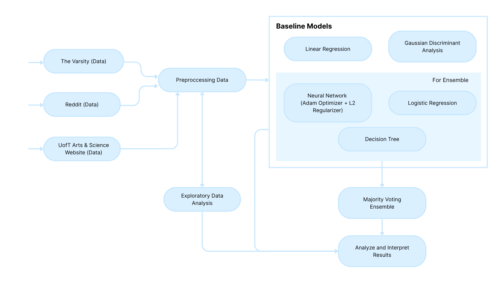

# Recommended or Not?: Applying Supervised Machine Learning Models to Understand UofT Course Evaluations

## Project Architecture 
 

## Package Versions
We recommend using the following versions for the libraries in requirements.txt. 
```
numpy<2
torch==2.0.1
scipy==1.10.1
pandas==1.5.3
scikit-learn==1.3.2
matplotlib==3.7.1
seaborn==0.12.2
```
